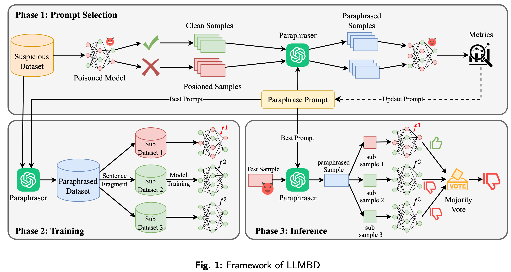

## LLMBD:BackdoorDefenseviaLargeLanguage Model ParaphrasingandDataVotingin NLP

### Abstract
With the rapid development of natural language processing (NLP), backdoor attacks have emerged as a significant security threat. These attacks inject malicious triggers into NLP models, causing them to produce adversarial output while remaining functional under normal input. To eliminate backdoors,existingdata-drivendefensemethodstypicallytransformbackdooredsamplesintonormal samples.However,thesedefenseslackthescalabilitytoadapteffectivelytovariousbackdoorattacks. To address this challenge, we propose LLMBD, a novel data-driven backdoor defense method that leverageslargelanguagemodels(LLMs)forparaphrasing.Specifically,LLMBDuseslargelanguage models with optimized prompts to paraphrase the input text, eliminating potential backdoors while maintainingsemanticintegrityandtextualfluency.Duringthetrainingandinferencephase,weapply grouping and major voting mechanisms to bypass residual backdoors in the paraphrased dataset. Finally, we validate the robustness and defense effectiveness of LLMBD through comprehensive modelevaluations.ExperimentalresultsondatasetsincludingSST-2,IMDB,andHSOLundervarious backdoorattacktypes(BadNets,AddSent,Synbkd,Stylebkd)showthatLLMBDsignificantlyoutper- forms existing methods such as RAP, STRIP, ParaFuzz, and TextGuard. On the SST-2, HSOL, and IMDbdatasets,LLMBDachievesanaverageASRdropof0.278,withtheaverageCACCmaintained at0.897.LLMBDexhibitssuperiorrobustness,generalization,andperformancepreservationwithout modifications to the backdoored model, providing an efficient and model-agnostic defense strategy against diverse backdoor threats.
### Framework

